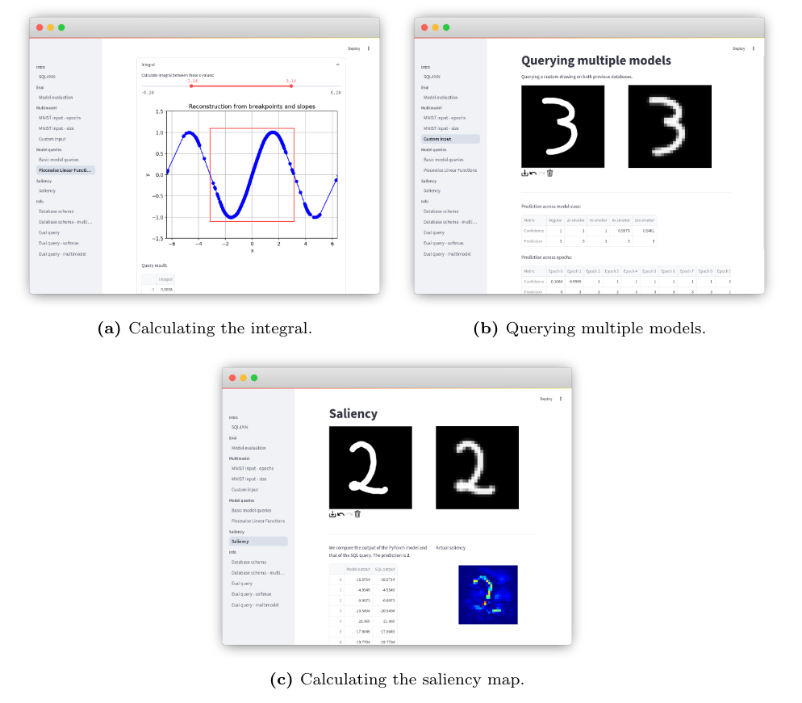

# Demo Application

Demo application showcasing various interactive model queries, intended to be
run on commodity hardware (i.e. a laptop).

## Setup

Install dependencies:

```bash
python3 -m venv venv
. venv/bin/activate
pip install -r requirements.txt
```

Make sure the notebook `preparation.ipynb` is run once. It creates the used
models and databases.

## Running the app

```bash
. venv/bin/activate
streamlit run app.py
```


